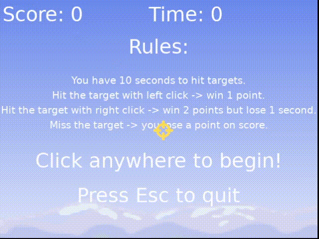

Simple project for first topic of course 'Lua Programming and Game Development with LÖVE' (I LÖVEd this course https://www.udemy.com/course/lua-love)

### In this game you control a crosshair with mouse and hit as many target as you can in 10 seconds! :bow_and_arrow:

## Rules :dart::
- :triangular_flag_on_post: You have 10 seconds to hit targets :hourglass_flowing_sand:
- :triangular_flag_on_post: Hit the target with left click -> win 1 point :medal_sports:
- :triangular_flag_on_post: Hit the target with right click -> win 2 points but lose 1 second :trollface:
- :triangular_flag_on_post: Miss the target -> you lose a point on score :man_shrugging: :woman_shrugging:

See sample below :eyes:

You can test this game on PC by accessing page https://jgfenix.github.io/target_shooting_game/shooting_game_demo.html

(generated html by https://schellingb.github.io/LoveWebBuilder :heart:)

